# 101431281LabTest2Comp3133 – SpaceX Mission Tracker

This is an Angular application created for Lab Test 2 in COMP3133. The app fetches and displays SpaceX mission data using the public SpaceX API (https://api.spacexdata.com/v3/launches). Users can filter missions by launch year, launch success, and landing success. Angular Material is used to enhance the user interface with consistent design elements.

> Developed using Angular 16 and Angular Material with standalone components.

---

## Features

- Filter missions by year, launch success, and landing success
- Styled with Angular Material (Azure/Blue theme)
- Consumes live SpaceX REST API
- View mission name, year, rocket details, and links to article, Wikipedia, and video
- Clean UI with responsive layout and filtering

---

## Technologies Used

| Tech                  | Description                    |
|------------------     |--------------------------------|
| Angular 16            | Framework for SPA              |
| Angular Material      | UI components & styling        |
| TypeScript            | Strongly typed JavaScript      |
| RxJS / Observables    | API handling                |

---

## Development Server
To start a local dev server, run: ng serve
Then open your browser at: http://localhost:4200/
The app will auto-reload if you make changes to the source files.

---

## Code Scaffolding
ng generate component component-name
ng generate --help

---

## How It Works
All missions are fetched from: https://api.spacexdata.com/v3/launches

---

## Code Scaffolding
- Theme: Azure Blue (@angular/material/prebuilt-themes/azure-blue.css)
- Used modules:
  - MatCardModule
  - MatFormFieldModule
  - MatInputModule
  - MatRadioModule
  - MatButtonModule
- Custom styling:
  - Cards: Light green background (#d0f0c0)
  - Bold, enlarged text for filters

  ---

## Project Structure
src/
├── app/
│   ├── components/
│   │   ├── missiondetails/
│   │   │   ├── missiondetails.component.css
│   │   │   ├── missiondetails.component.html
│   │   │   ├── missiondetails.component.spec.ts
│   │   │   └── missiondetails.component.ts
│   │   ├── missionfilter/
│   │   │   ├── missionfilter.component.css
│   │   │   ├── missionfilter.component.html
│   │   │   ├── missionfilter.component.spec.ts
│   │   │   └── missionfilter.component.ts
│   │   └── missionlist/
│   │       ├── missionlist.component.css
│   │       ├── missionlist.component.html
│   │       ├── missionlist.component.spec.ts
│   │       └── missionlist.component.ts
│   ├── models/
│   │   └── launch.model.ts
│   ├── services/
│   │   ├── spacex.service.ts
│   │   ├── spacex.service.spec.ts
│   │   └── mission.service.ts
    ├── app.component.css  
    ├── app.component.html
    ├── app.component.spec.ts
│   ├── app.component.ts 
│   ├── app.routes.ts
│   └── app.config.ts
├── index.html
├── styles.css
└── main.ts

  ---

## Author
Student Name: Nigar Ahmadova
Student ID: 101431281
Course: COMP3133 – Full-Stack Development
Instructor: Professor Pritesh Patel
Date: April 02, 2025

 ---

## Notes
- This app was built under lab test conditions as part of COMP3133 Lab Test 2.
- Angular Material usage and API integration were required parts of the assignment.

---

## Additional Resources
- Angular CLI Overview: https://angular.dev/tools/cli
- Angular Material Docs: https://material.angular.io/
- SpaceX API Docs: https://github.com/r-spacex/SpaceX-API

## Links
- Live Render Deployment Link: https://spacex-mission-tracker.onrender.com/

- GitHub Repository Link: https://github.com/Nigar0826/101431281-lab-test2-comp3133

## Application Screenshots
### Starting Page
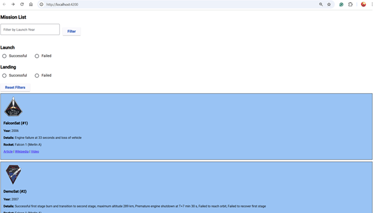
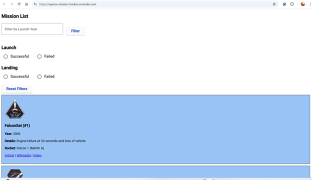

### Filtered by Year
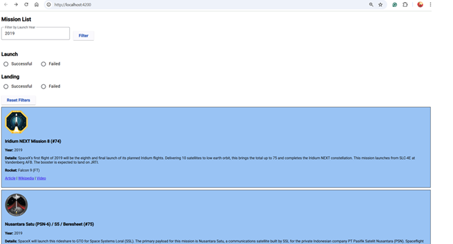
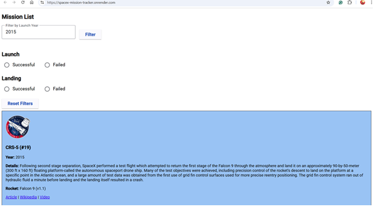

### Launch Filters
#### Successful
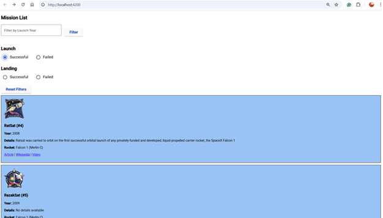

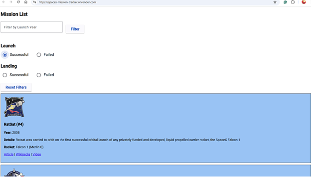

#### Failed
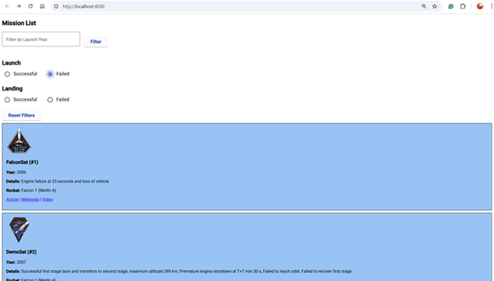

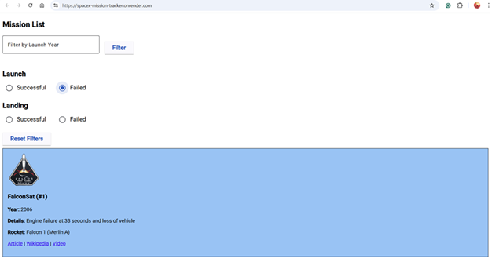

### Landing Filters
#### Successful
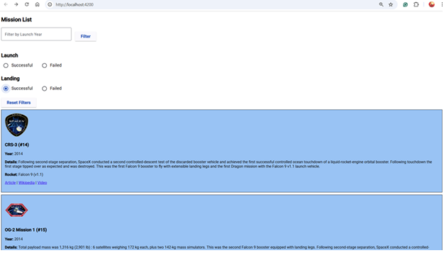

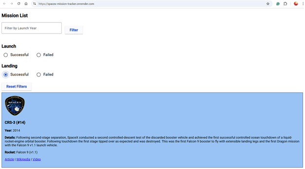

#### Failed
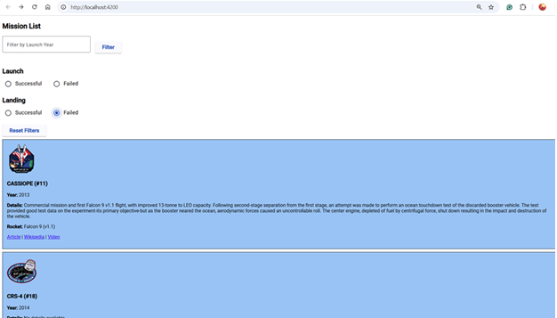

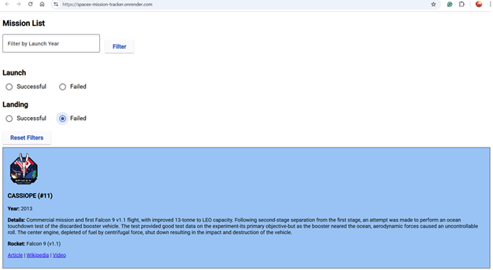